# Liquidation Dataset EDA Report

## Objective

Explore Binance trades, Binance BBO, Binance liquidations, and Bybit liquidations before building any trade-filter signal. The report focuses on conventions, data quality, markouts, liquidation context, and cross-source relationships.

## Execution Profile

- Profile: `full`
- Generated at UTC: `2026-05-21T21:45:58Z`
- Config: `configs/liquidation_eda.yaml`
- Data scope: `Core markout, liquidation context, OFI, queue imbalance, response functions, and event-study tables are computed on all rows for the selected profile. Deterministic samples are used only for visual distribution plots.`
- Full processed trade rows: `1107782898`
- Full processed BBO rows: `206966513`

## Key Findings

- Total raw rows across sources: `1,315,384,304`.
- Best full-data maker markout bucket: `ethusdt buy 300s`, `0.753097` bps.
- Worst full-data maker markout bucket: `btcusdt sell 300s`, `-0.597991` bps.
- Trade-side convention is diagnosed by comparing trade prices to previous BBO; see `trade_price_location_summary.csv`.

## Convention Checks

- Timestamps are interpreted as microseconds since UNIX epoch UTC.
- Binance trade `side` is treated as taker side.
- Liquidation `side` is treated as liquidation order side.
- Bybit liquidation features use `available_timestamp = timestamp + 200_000`.
- Known-at-time joins are backward as-of joins; future markouts join to BBO at `trade_timestamp + tau` using backward fill.

## Source Files

| source | symbol | size_mb | exists |
| --- | --- | --- | --- |
| binance_trades | btcusdt | 1,294.43 | true |
| binance_booktickers | btcusdt | 796.615 | true |
| binance_liquidations | btcusdt | 1.4459 | true |
| bybit_liquidations | btcusdt | 2.4372 | true |
| binance_trades | ethusdt | 2,118.51 | true |
| binance_booktickers | ethusdt | 1,249.32 | true |
| binance_liquidations | ethusdt | 1.8129 | true |
| bybit_liquidations | ethusdt | 1.7989 | true |

Full table: `reports/liquidation_eda/tables/source_files.csv`

## Time Coverage

| source | symbol | rows | min_datetime_utc | max_datetime_utc | duplicate_timestamp_rows |
| --- | --- | --- | --- | --- | --- |
| binance_trades | btcusdt | 401902513 | 2025-12-01T00:00:00.047000+00:00 | 2026-02-28T23:59:59.992000+00:00 | 316865596 |
| binance_booktickers | btcusdt | 99169477 | 2025-12-01T00:00:02.075000+00:00 | 2026-02-28T23:59:59.949000+00:00 | 0 |
| binance_liquidations | btcusdt | 114255 | 2025-12-01T00:00:06.091000+00:00 | 2026-02-28T23:59:10.548000+00:00 | 0 |
| bybit_liquidations | btcusdt | 228655 | 2025-12-01T00:00:02.915000+00:00 | 2026-02-28T23:58:42.271000+00:00 | 5094 |
| binance_trades | ethusdt | 705880385 | 2025-12-01T00:00:00.016000+00:00 | 2026-02-28T23:59:59.993000+00:00 | 597583948 |
| binance_booktickers | ethusdt | 107797036 | 2025-12-01T00:00:00.683000+00:00 | 2026-02-28T23:59:59.829000+00:00 | 0 |
| binance_liquidations | ethusdt | 131769 | 2025-12-01T00:00:09.455000+00:00 | 2026-02-28T23:49:50.541000+00:00 | 0 |
| bybit_liquidations | ethusdt | 160214 | 2025-12-01T00:00:07.779000+00:00 | 2026-02-28T23:34:22.075000+00:00 | 2664 |

Full table: `reports/liquidation_eda/tables/time_coverage.csv`

## BBO Quality

| split | date | symbol | rows | crossed_rows | locked_rows | mean_spread_bps | mean_queue_imbalance |
| --- | --- | --- | --- | --- | --- | --- | --- |
| train | 2025-12-01 | btcusdt | 1322826 | 0 | 0 | 0.014099 | 0.499764 |
| train | 2025-12-02 | btcusdt | 1225630 | 0 | 0 | 0.012829 | 0.498836 |
| train | 2025-12-03 | btcusdt | 1238214 | 0 | 0 | 0.012697 | 0.50359 |
| train | 2025-12-04 | btcusdt | 1162876 | 0 | 0 | 0.011905 | 0.507461 |
| train | 2025-12-05 | btcusdt | 1186973 | 0 | 0 | 0.012538 | 0.509135 |
| train | 2025-12-06 | btcusdt | 889560 | 0 | 0 | 0.011654 | 0.511195 |
| train | 2025-12-07 | btcusdt | 1047802 | 0 | 0 | 0.012892 | 0.506076 |
| train | 2025-12-08 | btcusdt | 1140764 | 0 | 0 | 0.012081 | 0.507408 |
| train | 2025-12-09 | btcusdt | 1150554 | 0 | 0 | 0.012472 | 0.501872 |
| train | 2025-12-10 | btcusdt | 1171667 | 0 | 0 | 0.013221 | 0.505025 |
| train | 2025-12-11 | btcusdt | 1251127 | 0 | 0 | 0.01244 | 0.500298 |
| train | 2025-12-12 | btcusdt | 1183462 | 0 | 0 | 0.012293 | 0.502528 |

Full table: `reports/liquidation_eda/tables/bbo_quality.csv`

## Trade Side vs BBO Location

| split | symbol | side | price_location | rows | share_within_side |
| --- | --- | --- | --- | --- | --- |
| train | btcusdt | buy | above_ask | 2002185 | 0.590407 |
| train | btcusdt | buy | at_ask | 1323727 | 0.390342 |
| train | btcusdt | buy | inside_spread | 13623 | 0.004017 |
| train | btcusdt | buy | at_bid | 4099 | 0.001209 |
| train | btcusdt | buy | below_bid | 47535 | 0.014017 |
| train | btcusdt | buy | outside_or_ambiguous | 0 | 0 |
| train | btcusdt | buy | missing_bbo | 26 | 0.000008 |
| train | btcusdt | sell | above_ask | 43687 | 0.012938 |
| train | btcusdt | sell | at_ask | 3041 | 0.000901 |
| train | btcusdt | sell | inside_spread | 13147 | 0.003893 |
| train | btcusdt | sell | at_bid | 1237173 | 0.366388 |
| train | btcusdt | sell | below_bid | 2079393 | 0.615811 |

Full table: `reports/liquidation_eda/tables/trade_price_location_summary.csv`

## Liquidation Summary

| split | date | venue | symbol | side | rows | mean_notional | notional_sum | clipped_turnover |
| --- | --- | --- | --- | --- | --- | --- | --- | --- |
| train | 2025-12-01 | binance | btcusdt | buy | 963 | 8,594.7 | 8,276,695.89 | 7,311,442.9 |
| train | 2025-12-01 | binance | btcusdt | sell | 1959 | 10,922.41 | 21,396,996.29 | 14,539,497.27 |
| train | 2025-12-01 | bybit | btcusdt | buy | 1016 | 11,048.84 | 11,225,621.73 | 7,093,934.13 |
| train | 2025-12-01 | bybit | btcusdt | sell | 6026 | 13,640.59 | 82,198,219.45 | 44,595,249.46 |
| train | 2025-12-02 | binance | btcusdt | buy | 1094 | 9,260.18 | 10,130,635.57 | 8,248,406.16 |
| train | 2025-12-02 | binance | btcusdt | sell | 551 | 7,194.98 | 3,964,433.21 | 3,127,735.08 |
| train | 2025-12-02 | bybit | btcusdt | buy | 2629 | 12,587.68 | 33,093,013.55 | 20,870,161.43 |
| train | 2025-12-02 | bybit | btcusdt | sell | 396 | 7,934.86 | 3,142,204.71 | 2,311,809.69 |
| train | 2025-12-03 | binance | btcusdt | buy | 1126 | 10,807.55 | 12,169,296.45 | 7,825,834.78 |
| train | 2025-12-03 | binance | btcusdt | sell | 641 | 8,399.83 | 5,384,289.58 | 4,432,051.01 |
| train | 2025-12-03 | bybit | btcusdt | buy | 1888 | 17,528.63 | 33,094,056.55 | 14,442,213.9 |
| train | 2025-12-03 | bybit | btcusdt | sell | 814 | 10,343.54 | 8,419,639.22 | 5,796,614.27 |

Full table: `reports/liquidation_eda/tables/liquidation_summary.csv`

## Baseline Maker Markout

| split | symbol | side | horizon_seconds | rows | weighted_pnl_bps | clipped_turnover |
| --- | --- | --- | --- | --- | --- | --- |
| train | btcusdt | buy | 30 | 105263318 | -0.233596 | 343,221,630,216.49 |
| train | btcusdt | sell | 30 | 106083728 | 0.021522 | 347,838,206,331.58 |
| train | btcusdt | buy | 120 | 105264142 | -0.047059 | 343,203,827,611.37 |
| train | btcusdt | sell | 120 | 106078253 | 0.056062 | 347,790,281,957.78 |
| train | btcusdt | buy | 300 | 105272115 | 0.338131 | 343,249,301,451.39 |
| train | btcusdt | sell | 300 | 106089556 | -0.263543 | 347,856,670,299.43 |
| validation | btcusdt | buy | 30 | 95070810 | -0.218252 | 204,413,814,678.69 |
| validation | btcusdt | sell | 30 | 95425707 | -0.157573 | 205,863,315,941.14 |
| validation | btcusdt | buy | 120 | 95070846 | 0.028102 | 204,414,664,367.56 |
| validation | btcusdt | sell | 120 | 95425594 | -0.375281 | 205,863,881,688.98 |
| validation | btcusdt | buy | 300 | 95066763 | 0.29033 | 204,404,890,412.79 |
| validation | btcusdt | sell | 300 | 95423900 | -0.597991 | 205,861,618,868.11 |

Full table: `reports/liquidation_eda/tables/baseline_all_trades_markout.csv`

## Markout By Liquidation Context

| symbol | side | horizon_seconds | liq_pressure_bucket | venue | window_seconds | maker_vs_liq_pressure | rows | weighted_pnl_bps |
| --- | --- | --- | --- | --- | --- | --- | --- | --- |
| btcusdt | buy | 30 | downward_pressure | binance | 1 | opposite_direction | 3561639 | -1.6517 |
| btcusdt | buy | 30 | no_pressure | binance | 1 | none | 97770378 | -0.22019 |
| btcusdt | buy | 30 | upward_pressure | binance | 1 | same_direction_toxic_risk | 3931301 | 0.59184 |
| btcusdt | sell | 30 | downward_pressure | binance | 1 | same_direction_toxic_risk | 5410081 | 2.2977 |
| btcusdt | sell | 30 | no_pressure | binance | 1 | none | 97980518 | -0.170249 |
| btcusdt | sell | 30 | upward_pressure | binance | 1 | opposite_direction | 2693129 | -0.253263 |
| btcusdt | buy | 30 | downward_pressure | binance | 5 | opposite_direction | 8273420 | -0.964583 |
| btcusdt | buy | 30 | no_pressure | binance | 5 | none | 88285471 | -0.20715 |
| btcusdt | buy | 30 | upward_pressure | binance | 5 | same_direction_toxic_risk | 8704427 | 0.151914 |
| btcusdt | sell | 30 | downward_pressure | binance | 5 | same_direction_toxic_risk | 10918505 | 1.4445 |
| btcusdt | sell | 30 | no_pressure | binance | 5 | none | 88481088 | -0.22858 |
| btcusdt | sell | 30 | upward_pressure | binance | 5 | opposite_direction | 6684135 | -0.137169 |

Full table: `reports/liquidation_eda/tables/markout_by_liquidation_context.csv`

## Train Validation Drift

| source | symbol | split | rows |
| --- | --- | --- | --- |
| binance_booktickers | btcusdt | train | 65654006 |
| binance_trades | ethusdt | train | 388981166 |
| bybit_liquidations | btcusdt | train | 124465 |
| binance_trades | btcusdt | validation | 190513050 |
| binance_booktickers | ethusdt | validation | 35257016 |
| binance_booktickers | ethusdt | train | 72540020 |
| binance_booktickers | btcusdt | validation | 33515471 |
| binance_trades | btcusdt | train | 211389463 |
| binance_liquidations | btcusdt | train | 63660 |
| bybit_liquidations | ethusdt | train | 97116 |
| binance_liquidations | ethusdt | train | 76634 |
| binance_liquidations | ethusdt | validation | 55135 |

Full table: `reports/liquidation_eda/tables/train_validation_drift.csv`

## Signed Flow Response

| split | symbol | flow_type | horizon_seconds | response_bps | rows | abs_signed_flow_musd |
| --- | --- | --- | --- | --- | --- | --- |
| train | btcusdt | binance_trade_flow | 1 | -0.028514 | 211364640 | 759,442.48 |
| train | btcusdt | binance_trade_flow | 5 | -0.051097 | 211363577 | 759,440.53 |
| train | btcusdt | binance_trade_flow | 10 | -0.10907 | 211361120 | 759,431.76 |
| train | btcusdt | binance_trade_flow | 30 | -0.158817 | 211347046 | 759,382.22 |
| train | btcusdt | binance_trade_flow | 60 | -0.183809 | 211332855 | 759,199.45 |
| train | btcusdt | binance_trade_flow | 120 | -0.11455 | 211342395 | 759,228.18 |
| train | btcusdt | binance_trade_flow | 300 | 0.259875 | 211361671 | 759,429.12 |
| train | btcusdt | binance_liquidation_flow | 1 | 0.873156 | 63660 | 737.614 |
| train | btcusdt | binance_liquidation_flow | 5 | 0.749431 | 63660 | 737.614 |
| train | btcusdt | binance_liquidation_flow | 10 | 0.620862 | 63659 | 737.554 |
| train | btcusdt | binance_liquidation_flow | 30 | 0.621573 | 63650 | 737.301 |
| train | btcusdt | binance_liquidation_flow | 60 | -1.1395 | 63645 | 737.224 |

Full table: `reports/liquidation_eda/tables/signed_flow_response_functions.csv`

## Nonlinear Liquidation Pressure Buckets

| symbol | side | venue | window_seconds | horizon_seconds | signed_liq_bucket | rows | weighted_pnl_bps |
| --- | --- | --- | --- | --- | --- | --- | --- |
| btcusdt | buy | binance | 1 | 30 | zero | 97770378 | -0.22019 |
| btcusdt | buy | binance | 1 | 30 | pos_1e2 | 1562121 | 1.0713 |
| btcusdt | buy | binance | 1 | 30 | pos_1e3 | 1618600 | 0.144797 |
| btcusdt | buy | binance | 1 | 30 | pos_1e4 | 613262 | 0.712791 |
| btcusdt | buy | binance | 1 | 30 | pos_1e5 | 107391 | -0.269969 |
| btcusdt | buy | binance | 1 | 30 | neg_1e1 | 34970 | 3.2686 |
| btcusdt | buy | binance | 1 | 30 | neg_1e2 | 1589027 | -1.918 |
| btcusdt | buy | binance | 1 | 30 | neg_1e3 | 1363592 | -1.7252 |
| btcusdt | buy | binance | 1 | 30 | neg_1e4 | 486948 | -1.4427 |
| btcusdt | buy | binance | 1 | 30 | neg_1e5 | 76222 | 1.4238 |
| btcusdt | buy | binance | 1 | 30 | neg_1e6 | 10206 | -0.565431 |
| btcusdt | sell | binance | 1 | 30 | zero | 97980518 | -0.170249 |

Full table: `reports/liquidation_eda/tables/nonlinear_flow_response.csv`

## As-Of Sensitivity

| asof_mode | split | date | symbol | side | price_location | rows | share_within_side |
| --- | --- | --- | --- | --- | --- | --- | --- |
| same_timestamp_allowed | train | 2025-12-01 | btcusdt | buy | above_ask | 2002185 | 0.590407 |
| strictly_previous_bbo | train | 2025-12-01 | btcusdt | buy | above_ask | 2012477 | 0.593442 |
| same_timestamp_allowed | train | 2025-12-01 | btcusdt | buy | at_ask | 1323727 | 0.390342 |
| strictly_previous_bbo | train | 2025-12-01 | btcusdt | buy | at_ask | 1311139 | 0.38663 |
| same_timestamp_allowed | train | 2025-12-01 | btcusdt | buy | inside_spread | 13623 | 0.004017 |
| strictly_previous_bbo | train | 2025-12-01 | btcusdt | buy | inside_spread | 13816 | 0.004074 |
| same_timestamp_allowed | train | 2025-12-01 | btcusdt | buy | at_bid | 4099 | 0.001209 |
| strictly_previous_bbo | train | 2025-12-01 | btcusdt | buy | at_bid | 4170 | 0.00123 |
| same_timestamp_allowed | train | 2025-12-01 | btcusdt | buy | below_bid | 47535 | 0.014017 |
| strictly_previous_bbo | train | 2025-12-01 | btcusdt | buy | below_bid | 49567 | 0.014616 |
| same_timestamp_allowed | train | 2025-12-01 | btcusdt | buy | outside_or_ambiguous | 0 | 0 |
| strictly_previous_bbo | train | 2025-12-01 | btcusdt | buy | outside_or_ambiguous | 0 | 0 |
| same_timestamp_allowed | train | 2025-12-01 | btcusdt | buy | missing_bbo | 26 | 0.000008 |
| strictly_previous_bbo | train | 2025-12-01 | btcusdt | buy | missing_bbo | 26 | 0.000008 |
| same_timestamp_allowed | train | 2025-12-01 | btcusdt | sell | above_ask | 43687 | 0.012938 |
| strictly_previous_bbo | train | 2025-12-01 | btcusdt | sell | above_ask | 45000 | 0.013327 |

Full table: `reports/liquidation_eda/tables/asof_sensitivity.csv`

## Liquidation Event Study

| split | symbol | venue | side | offset_seconds | rows | mean_return_bps |
| --- | --- | --- | --- | --- | --- | --- |
| train | btcusdt | binance | buy | -300 | 963 | -22.024 |
| train | btcusdt | binance | sell | -300 | 1909 | 28.057 |
| train | btcusdt | binance | buy | -120 | 963 | -18.988 |
| train | btcusdt | binance | sell | -120 | 1948 | 17.966 |
| train | btcusdt | binance | buy | -60 | 963 | -15.423 |
| train | btcusdt | binance | sell | -60 | 1952 | 12.741 |
| train | btcusdt | binance | buy | -30 | 963 | -11.347 |
| train | btcusdt | binance | sell | -30 | 1952 | 9.4709 |
| train | btcusdt | binance | buy | -10 | 963 | -6.177 |
| train | btcusdt | binance | sell | -10 | 1956 | 5.1161 |
| train | btcusdt | binance | buy | -5 | 963 | -3.861 |
| train | btcusdt | binance | sell | -5 | 1958 | 3.152 |
| train | btcusdt | binance | buy | -1 | 963 | -0.443722 |
| train | btcusdt | binance | sell | -1 | 1959 | 0.235362 |
| train | btcusdt | binance | buy | 0 | 963 | 0 |
| train | btcusdt | binance | sell | 0 | 1959 | 0 |

Full table: `reports/liquidation_eda/tables/event_study_summary.csv`

## Anomaly Log

| symbol | source | issue_type | severity | notes |
| --- | --- | --- | --- | --- |
| btcusdt | binance_trades | trade_far_or_ambiguous_vs_bbo | medium | split=train buy above_ask rows=60845946 |
| btcusdt | binance_trades | trade_far_or_ambiguous_vs_bbo | medium | split=train buy below_bid rows=1281190 |
| btcusdt | binance_trades | trade_far_or_ambiguous_vs_bbo | medium | split=train sell above_ask rows=1254542 |
| btcusdt | binance_trades | trade_far_or_ambiguous_vs_bbo | medium | split=train sell below_bid rows=61903396 |
| btcusdt | binance_trades | trade_far_or_ambiguous_vs_bbo | medium | split=validation buy above_ask rows=61260430 |
| btcusdt | binance_trades | trade_far_or_ambiguous_vs_bbo | medium | split=validation buy below_bid rows=1925243 |
| btcusdt | binance_trades | trade_far_or_ambiguous_vs_bbo | medium | split=validation sell above_ask rows=1790312 |
| btcusdt | binance_trades | trade_far_or_ambiguous_vs_bbo | medium | split=validation sell below_bid rows=62152968 |
| ethusdt | binance_trades | trade_far_or_ambiguous_vs_bbo | medium | split=train buy above_ask rows=118115945 |
| ethusdt | binance_trades | trade_far_or_ambiguous_vs_bbo | medium | split=train buy below_bid rows=3430581 |
| ethusdt | binance_trades | trade_far_or_ambiguous_vs_bbo | medium | split=train sell above_ask rows=3461508 |
| ethusdt | binance_trades | trade_far_or_ambiguous_vs_bbo | medium | split=train sell below_bid rows=120658597 |
| ethusdt | binance_trades | trade_far_or_ambiguous_vs_bbo | medium | split=validation buy above_ask rows=107243780 |
| ethusdt | binance_trades | trade_far_or_ambiguous_vs_bbo | medium | split=validation buy below_bid rows=3964972 |
| ethusdt | binance_trades | trade_far_or_ambiguous_vs_bbo | medium | split=validation sell above_ask rows=3875534 |
| ethusdt | binance_trades | trade_far_or_ambiguous_vs_bbo | medium | split=validation sell below_bid rows=109151501 |
| btcusdt | binance_trades | duplicate_timestamps | low | duplicate_timestamp_rows=316865596 |
| btcusdt | bybit_liquidations | duplicate_timestamps | low | duplicate_timestamp_rows=5094 |
| ethusdt | binance_trades | duplicate_timestamps | low | duplicate_timestamp_rows=597583948 |
| ethusdt | bybit_liquidations | duplicate_timestamps | low | duplicate_timestamp_rows=2664 |

Full table: `reports/liquidation_eda/tables/anomaly_log.csv`

## Figures

### Events By Day

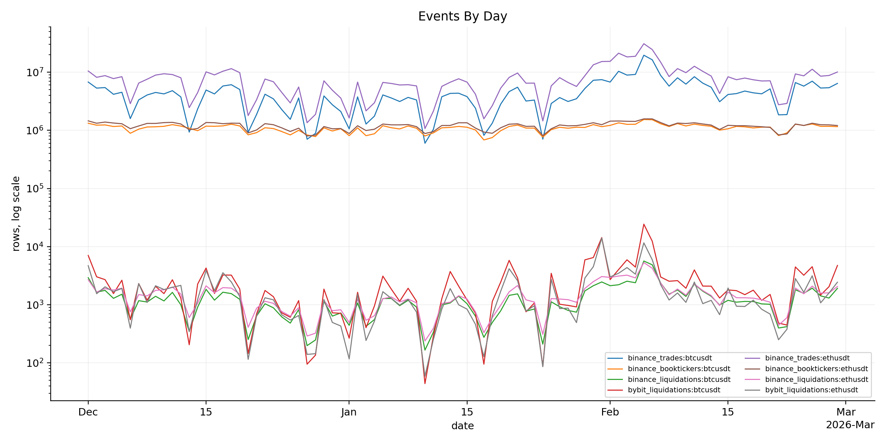

### Spread Distribution

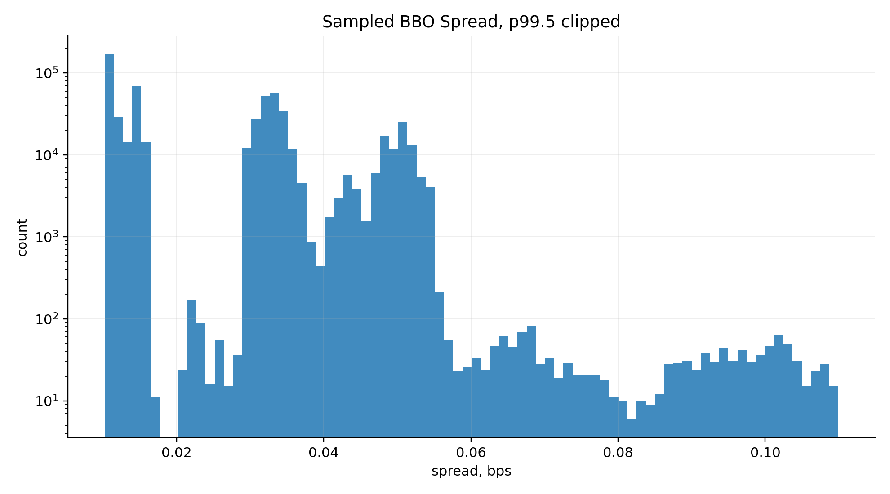

### Trade Notional Distribution

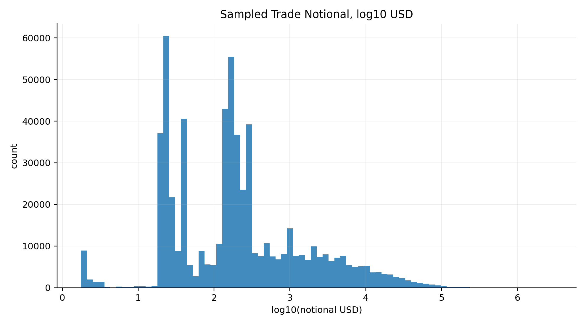

### Liquidation Notional Distribution

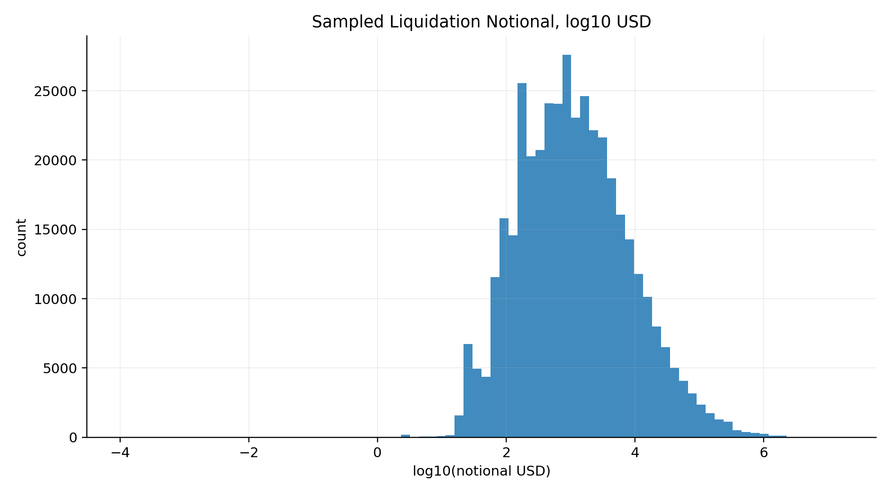

### OFI vs Future Return

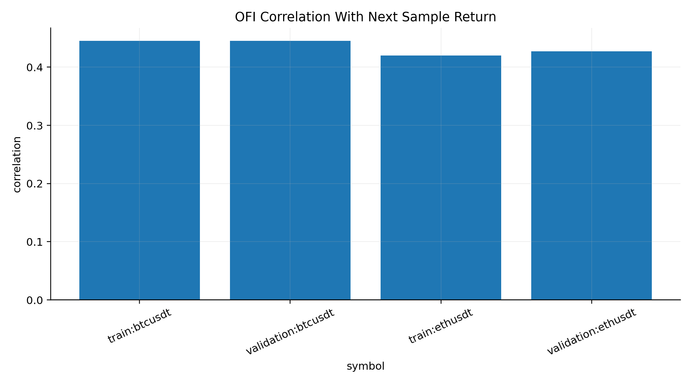

### Queue Imbalance Next Move

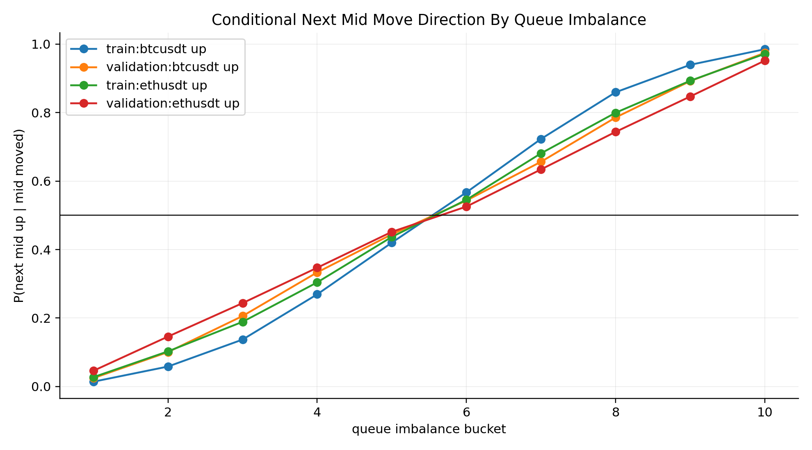

### Markout Distribution

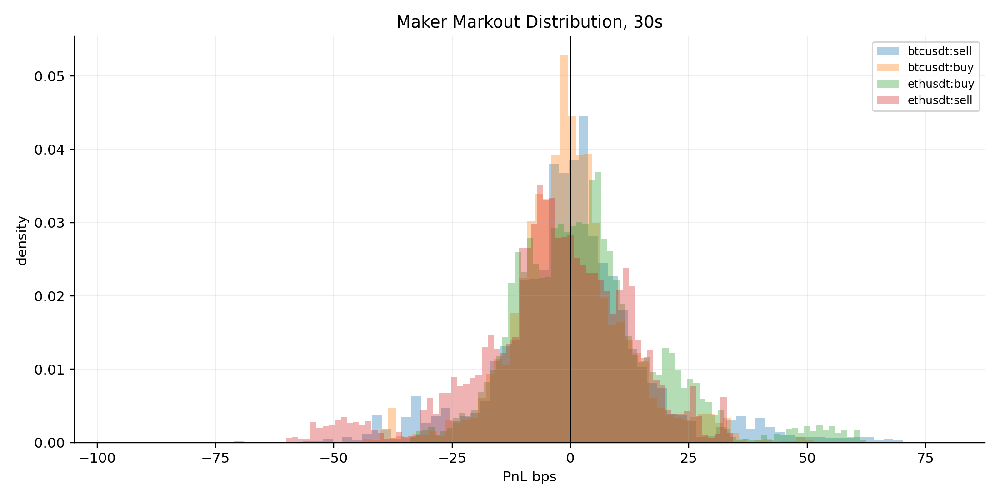

### Markout Curve

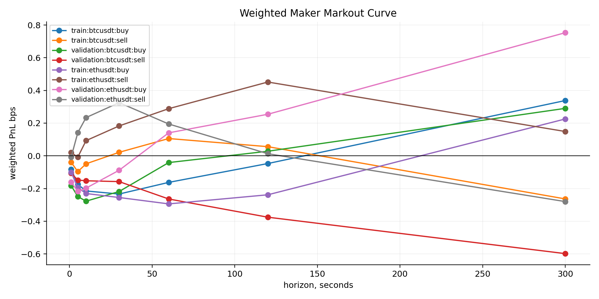

### Signed Flow Response

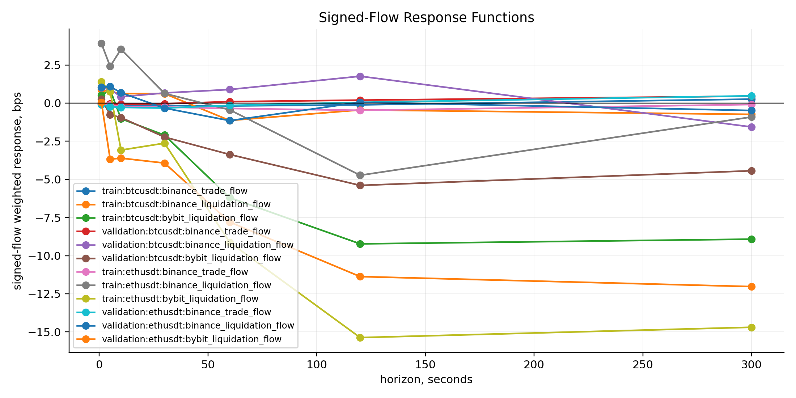

### Nonlinear Flow Response

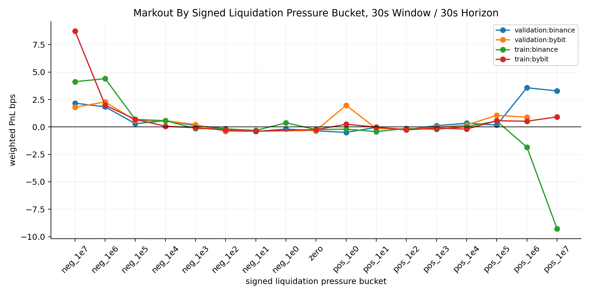

### Liquidation Event Study

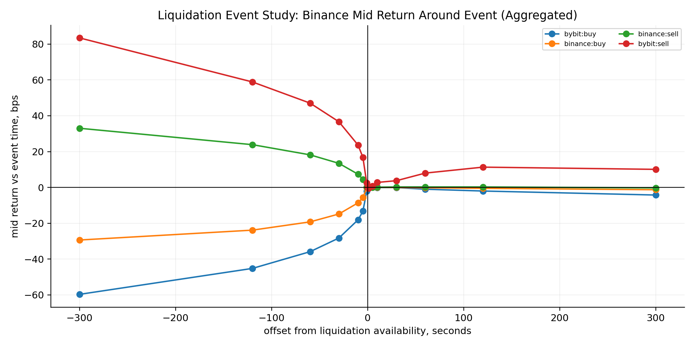

### Liquidation Event Study By Venue Side Symbol

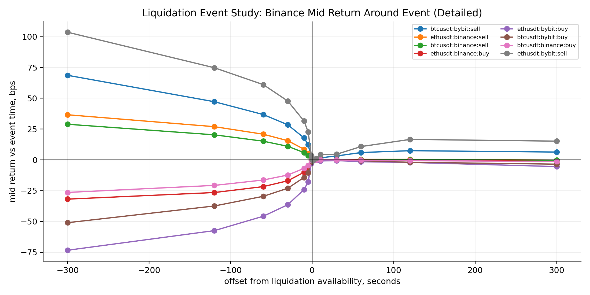

## Research Hypotheses For Future Signal

- Filter trades where maker direction is aligned against recent same-direction liquidation pressure.
- Bybit liquidation clusters may be more informative than isolated prints after the required 200ms availability delay.
- OFI and queue imbalance may help separate toxic from normal trades in short horizons.
- Liquidation impact may be nonlinear: extreme clusters can saturate or reverse.
- Cross-asset stress between BTC and ETH should be tested before deciding whether signals are symbol-specific.

## Limitations

- Core markout and liquidation-context tables are full-data aggregates, not per-trade materializations. Deterministic samples are still used for visual distribution plots.
- This is not yet a final filter and does not optimize hidden-test score.
- Same-timestamp event ordering cannot be fully recovered from public parquet files.

## Run Metadata

```json
{
  "config_path": "configs/liquidation_eda.yaml",
  "data_scope_note": "Core markout, liquidation context, OFI, queue imbalance, response functions, and event-study tables are computed on all rows for the selected profile. Deterministic samples are used only for visual distribution plots.",
  "full_data_batch_minutes": 60,
  "full_data_dates_processed": 90,
  "full_data_max_batches_per_date": 0,
  "full_data_mode": true,
  "generated_at_utc": "2026-05-21T21:45:58Z",
  "git_commit": "0998e7778f4f0d6436222a15cef8521ecf09d4ff",
  "numpy_version": "2.4.4",
  "outputs": [
    "reports/liquidation_eda/liquidation_eda_report.md",
    "reports/liquidation_eda/run_metadata.json"
  ],
  "phase_seconds": {
    "figures": 1.7679560838732868,
    "full_data_eda": 5898.22658612486,
    "sampled_symbol_eda": 18.673364834161475,
    "source_audit": 0.005378042114898562,
    "write_tables": 2.248356333002448
  },
  "platform": "macOS-26.4.1-arm64-arm-64bit-Mach-O",
  "polars_version": "1.40.1",
  "processed_bbo_rows_full": 206966513,
  "processed_trade_batches_full": 4320,
  "processed_trade_rows_full": 1107782898,
  "profile": "full",
  "python_version": "3.13.5",
  "source_audit_reused": true,
  "source_rows": {
    "binance_booktickers:btcusdt": 99169477,
    "binance_booktickers:ethusdt": 107797036,
    "binance_liquidations:btcusdt": 114255,
    "binance_liquidations:ethusdt": 131769,
    "binance_trades:btcusdt": 401902513,
    "binance_trades:ethusdt": 705880385,
    "bybit_liquidations:btcusdt": 228655,
    "bybit_liquidations:ethusdt": 160214
  }
}
```
